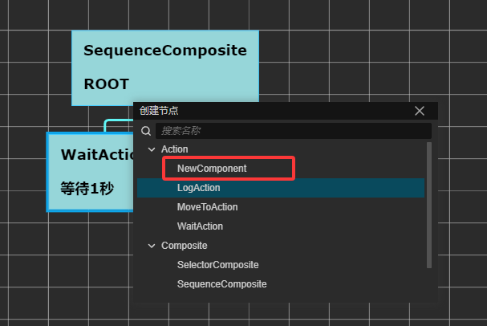

# 行为树
行为树的编辑器参考了[https://github.com/cocos/cocos-creator-extensions.git](官方shadernode)
运行时基于个人理解。

## 如何使用
1.导入插件并重启cocos creator
2.点击assets->创建->bt-graph 创建新的行为树资源

3.双击资源,打开并编辑

4.使用BTComponent


## 自定义组件
使用@bt_class传入类型，并继承BTNode
```
@bt_class(BTType.Action)
export class NewComponent extends BTAction {
    @bt_property(PropertyType.Float)
    get logStr(): BTFloat { return new BTFloat() }

    start() {

    }

    update(deltaTime: number) {

    }
}


```



## 绑定属性
1.使用bt_property传入属性类型，并在行为树编辑器中的inpspector中看到该属性
2.在变量中创建属性，并绑定
